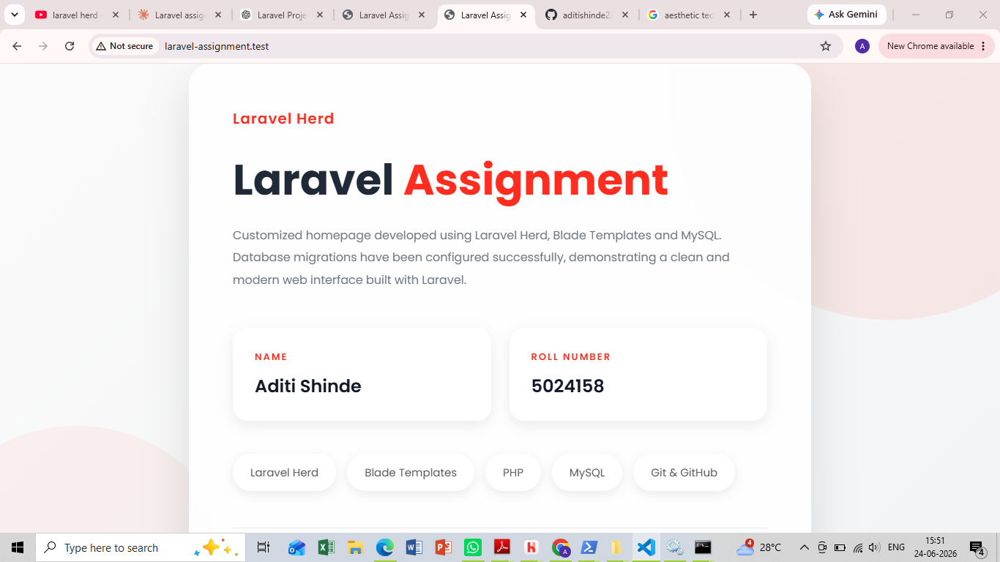

# Laravel Assignment

## Student Information

- **Name:** Aditi Shinde
- **Roll Number:** 5024158

## Description

This project was created using Laravel Herd. The default Laravel homepage was customized using Blade templates and CSS. MySQL database connectivity was configured successfully, and Laravel database migrations were executed to create the required tables.

## Database Migrations

The following tables were generated using:

```bash
herd php artisan migrate
```

- users
- cache
- jobs
- migrations

## Modified Homepage Screenshot



## Technologies Used

- Laravel Herd
- PHP
- Blade Templates
- MySQL
- Laravel Migrations
- Git & GitHub

## Author

Aditi Shinde
